# WiseCare Admin Dashboard 🚀

<p align="center">
  
</p>


## 🌟 Overview

WiseCare Admin is a powerful, modern administrative dashboard built with React and Vite. It provides a comprehensive solution for managing healthcare-related data, analytics, and administrative tasks with an intuitive and responsive interface.

## 📸 Screenshots

### Admin Interface

#### Dashboard
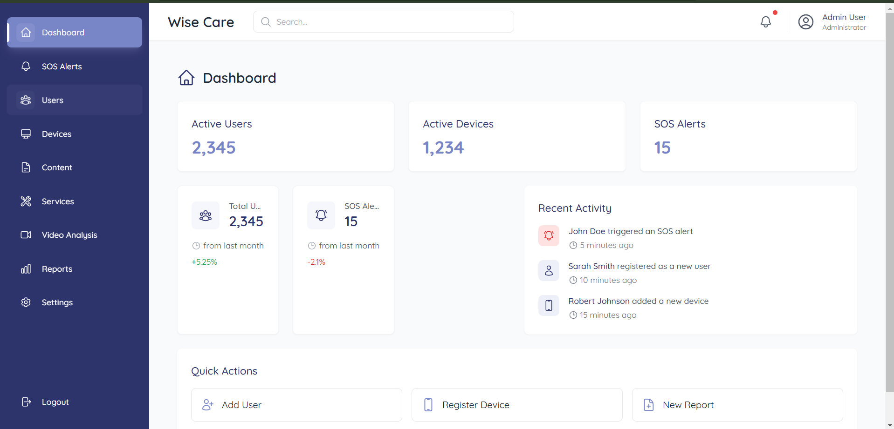

#### Login Screen


#### User Management
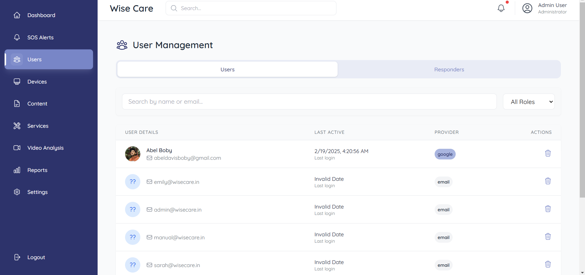

#### Services Management
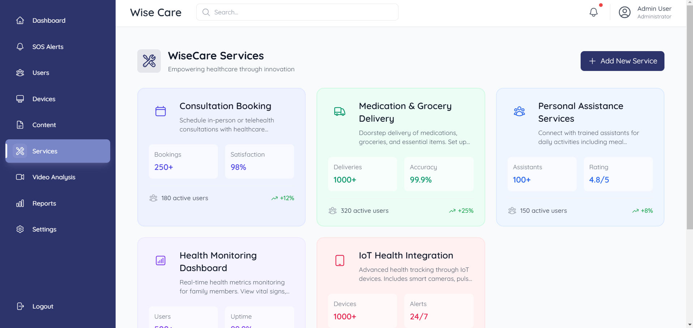

#### Consultation Booking


#### Reports
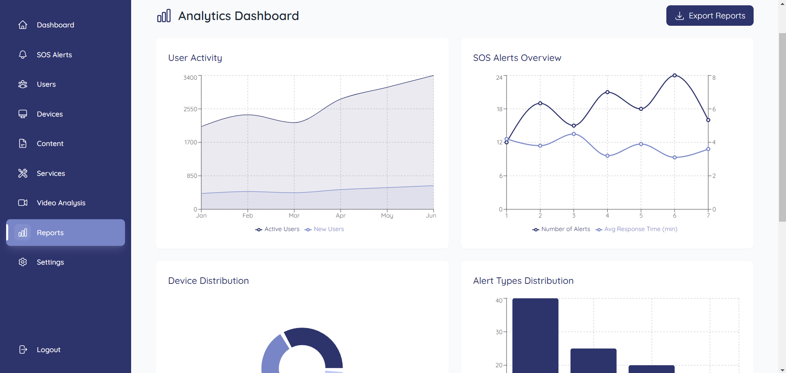

#### SOS Screen


#### Settings
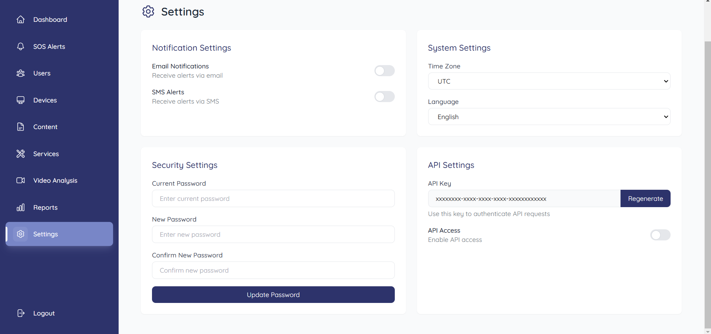

### Doctor Interface

#### Dashboard
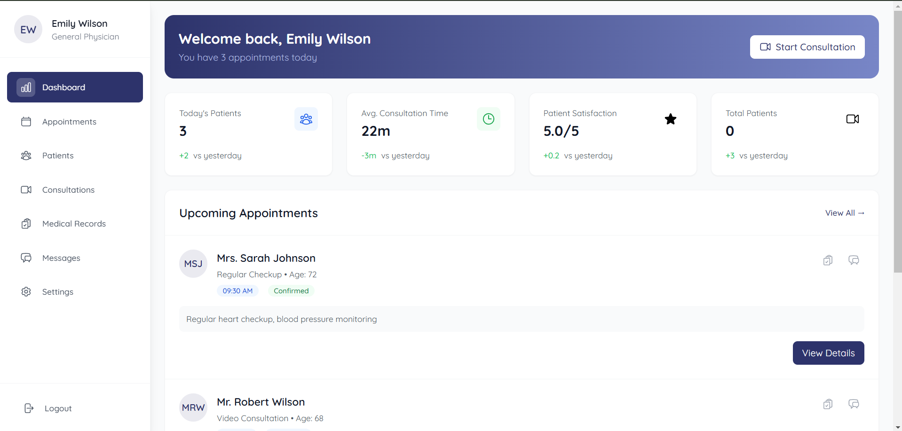

#### Login Screen


#### Appointments
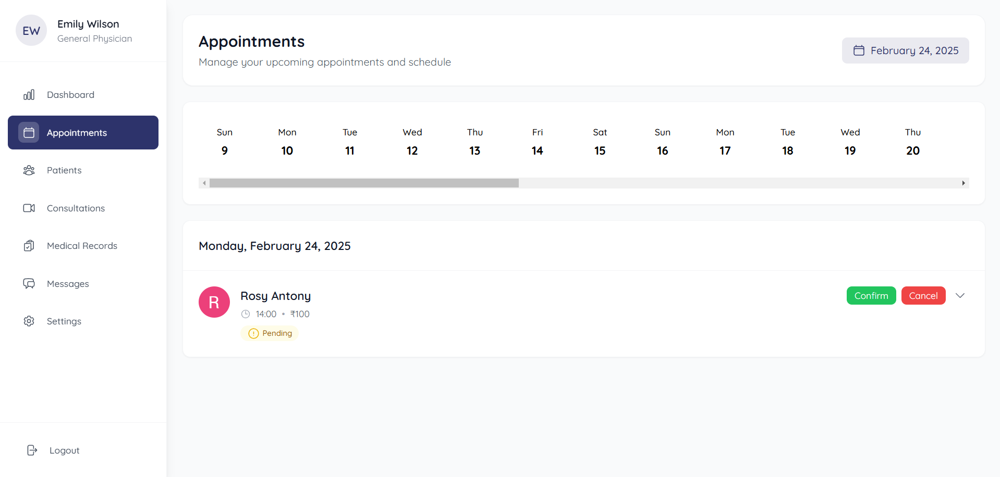

#### Patients
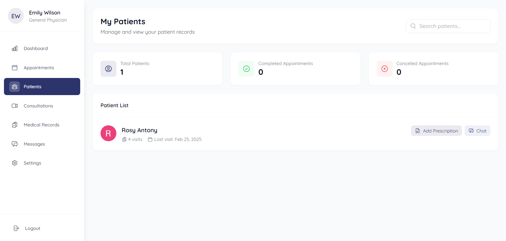

#### Consultations
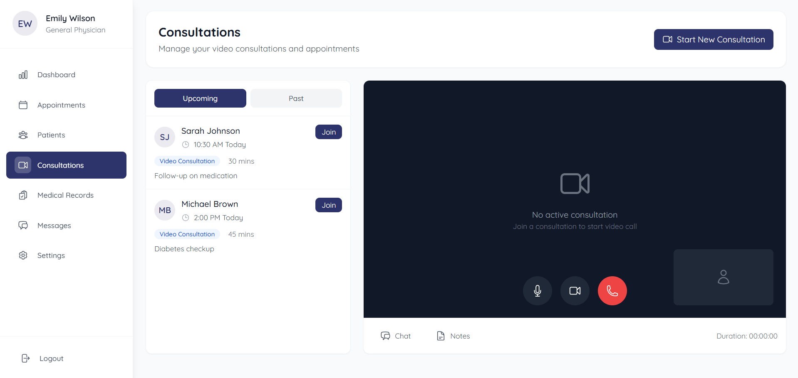

#### Medical Records


#### Messages
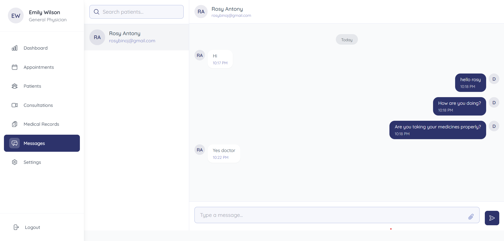

#### Settings
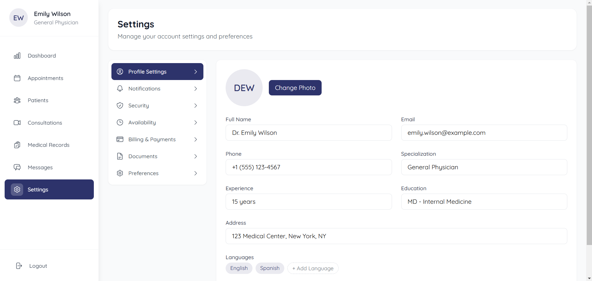

## ✨ Key Features

- 📊 **Advanced Analytics Dashboard**
  - Real-time data visualization using Chart.js and Recharts
  - Interactive graphs and charts
  - Customizable reporting tools

- 🔐 **Secure Authentication**
  - Firebase integration for robust security
  - Role-based access control
  - Secure data management

- 💼 **Administrative Tools**
  - User management system
  - PDF report generation with jsPDF
  - Data export capabilities

- 🎨 **Modern UI/UX**
  - Responsive design with Tailwind CSS
  - Smooth animations with Framer Motion
  - Intuitive navigation

## 🚀 Quick Start

### Prerequisites

- Node.js (v16 or higher)
- npm or yarn

### Installation

1. Clone the repository:
```bash
git clone https://github.com/kichuman28/wisecare-admin.git
cd wisecare-admin
```

2. Install dependencies:
```bash
npm install
# or
yarn install
```

3. Set up environment variables:
Create a `.env` file in the root directory and add necessary configurations.

4. Start the development server:
```bash
npm run dev
# or
yarn dev
```

## 🛠️ Built With

- **React** - UI Library
- **Vite** - Build Tool
- **Tailwind CSS** - Styling
- **Firebase** - Backend & Authentication
- **Chart.js & Recharts** - Data Visualization
- **React Query** - Data Fetching
- **React Router** - Navigation
- **Framer Motion** - Animations

## 📚 Documentation

For detailed documentation on components and API references, please visit our [Documentation](docs/README.md).

## 🤝 Contributing

We welcome contributions! Please see our [Contributing Guide](CONTRIBUTING.md) for details.

1. Fork the repository
2. Create your feature branch (`git checkout -b feature/AmazingFeature`)
3. Commit your changes (`git commit -m 'Add: Amazing Feature'`)
4. Push to the branch (`git push origin feature/AmazingFeature`)
5. Open a Pull Request

## 📝 License

This project is licensed under the MIT License - see the [LICENSE](LICENSE) file for details.

## 🙏 Acknowledgments

- Thanks to all contributors who have helped shape WiseCare Admin
- Special thanks to the open-source community

## 📧 Contact

For questions and support, please email: support@wisecare-admin.com

---

<div align="center">
Made with ❤️ by the WiseCare Team
</div>
